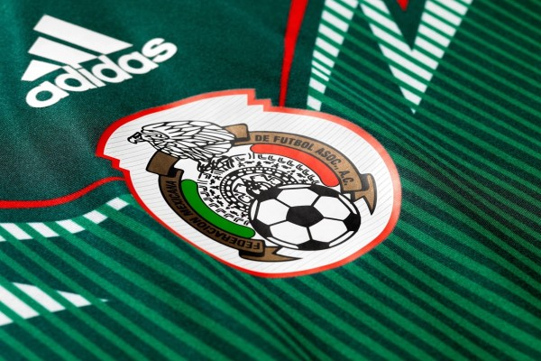

## Some background

FIFA, based in Zurich, Switzerland, is generally in charge of regulating and organizing the most important international soccer competitions, as well as resolving disputes between the different federations and, in turn, giving support to them. It is made up of more than two hundred federations and associations from around the world, which in turn are grouped into 6 major soccer confederations.

These soccer confederations result from the associations of the different FIFA members, either because they share common interests or because of location. They work, in their respective fields of action, for the organization and achievement of their objectives in the world of football. They are autonomous bodies but at the same time they respect the statutes and regulations established by FIFA and work in collaboration with it.

The six soccer confederations that make up FIFA include all the soccer teams in the world. They will be described below:

UEFA (Union of European Football Federations), is the football confederation of European countries, made up of 55 members and whose headquarters are also in Switzerland. It is without a doubt the most authoritative body in European football and one of the largest confederations in FIFA.

CAF (African Football Confederation), is the confederation with the second largest number of members after the European one, specifically it integrates 54 associations throughout the African continent. And in turn divides its territory into 6 regions (North, West A, West B, Central, Central-East and South).

AFC (Asian Football Confederation) is the regulatory body for Asian football. It is headquartered in Kuala Lumpur, Malaysia and consists of 47 members, including most of the countries in Asia and also interestingly Australia.

CONCACAF (North, Central America and Caribbean Association Football Confederation), made up of 41 members from three different zones, North America, Central America and the Caribbean. It is based in Miami and its main mission is the organization of soccer in its different aspects throughout the region from Canada to French Guiana, passing through Suriname.

OFC (Oceania Football Confederation), is the youngest of the six confederations. Made up of 14 members and based in Auckland, New Zealand, and despite what one might think, Australia is not part of this confederation.

CONMEBOL (South American Football Confederation), is the confederation with the smallest number of members, made up of only 10 associations that represent the most important countries in South America (Argentina, Bolivia, Brazil, Chile, Paraguay, Colombia, Venezuela, Peru , Uruguay and Ecuador).


## Case of study

On February 2, 2015, Australia became the Asian soccer champion. Probably, some people wonder why this team is an Asian champion if it is a country from Oceania.

When playing in the Oceania Confederation, Australia was used to winning almost every game almost without breaking a sweat, with great superiority. In fact, the 'aussies' hold the record for having achieved the biggest win in an international match after the 31-0 endorsement of American Samoa on April 11, 2001.

This win explains well why Australia asked to change from playing in the Oceania Confederation to playing in Asia. In the qualifying phases for the World Cup, Australia used to win, on most occasions, very easily and without much effort. However, contrary to what happens in other confederations, in Oceania no one has a direct ticket to the World Cup despite having been the best in qualifying.

The best in Oceania to get into a World Cup had to pass one last test: win in a qualifying round a team that could be South American or Asian, since it could vary depending on the year. This meant that it was very difficult for Australia to get into the World Cup because either they had a South American rival of a much higher level than them (as in 1993 with Argentina or in 2001 with Uruguay), or when they had to face a Asian team (as in 1997 against Iran), which were more equal to their quality, what happened is that they ended up losing because they accused of not having competitive tension in Oceania.

That was until Australia said enough was enough and proposed in 2005 to switch to the Asian Confederation. Surprisingly, they willingly accepted the offer and on March 23, 2005 they said yes to Australia. "I think Australia's arrival is beneficial for everyone, because it will improve the image of Asian football," said Mohamed Bin Hamman, president of the Asia Confederation at the time. "We have long had the objective of joining the Asian Football Confederation, as our current affiliation puts Australia in an abnormal situation," said Frank Lowy, his namesake in the Australian Federation.

The good news kept coming for the Australians when on April 17 of that same year from Oceania they also gave the ok to this peculiar change. "Australia's transfer to Asia is in the hands of the executive committee and I fully support it as it will help further develop football in Australia. At the same time it will open up many opportunities for other members of the Oceania confederation," Oceania Football Confederation President Reynald Temarii said in a statement.

However, not all oceanic countries liked this decision. New Zealand, through Graham Seatler, president of its Federation, made its discomfort public: "We are the weakest of the FIFA confederations and without Australia we will be even weaker." Their complaints fell on deaf ears, as FIFA also gave the OK to Australia's change on June 30. In this way, as of January 1, 2006, they were already officially registered as an Asian member and in February of that year they played their first official match in this confederation in the qualification for the 2007 Asian Cup.

The curious circumstance arises that one of the last things that Australia achieved as a member of the Oceanic Confederation was to qualify for the 2006 World Cup, after winning their qualifying tie against Uruguay on penalties, something that an Oceania team could not achieve. since 1974.

I gave myself the task of looking for a similar situation in the world, and I found the **Mexican** case.


## Methods


We'll use R in order to do our further analyses. I'll leave the code below each paragraph.


```r
library(tidyverse)
library(countrycode)
library(forcats)
library(ggflags)
```


The data set used in this analysis was taken from [Kaggle](https://www.kaggle.com/datasets/martj42/international-football-results-from-1872-to-2017).


```r
data <- read.csv(file = "results.csv",sep = ",")


head(data, 10)
```

```
##          date home_team away_team home_score away_score tournament    city
## 1  1872-11-30  Scotland   England          0          0   Friendly Glasgow
## 2  1873-03-08   England  Scotland          4          2   Friendly  London
## 3  1874-03-07  Scotland   England          2          1   Friendly Glasgow
## 4  1875-03-06   England  Scotland          2          2   Friendly  London
## 5  1876-03-04  Scotland   England          3          0   Friendly Glasgow
## 6  1876-03-25  Scotland     Wales          4          0   Friendly Glasgow
## 7  1877-03-03   England  Scotland          1          3   Friendly  London
## 8  1877-03-05     Wales  Scotland          0          2   Friendly Wrexham
## 9  1878-03-02  Scotland   England          7          2   Friendly Glasgow
## 10 1878-03-23  Scotland     Wales          9          0   Friendly Glasgow
##     country neutral
## 1  Scotland   FALSE
## 2   England   FALSE
## 3  Scotland   FALSE
## 4   England   FALSE
## 5  Scotland   FALSE
## 6  Scotland   FALSE
## 7   England   FALSE
## 8     Wales   FALSE
## 9  Scotland   FALSE
## 10 Scotland   FALSE
```

The variables used are presented below.


```r
glimpse(data)
```

```
## Rows: 44,353
## Columns: 9
## $ date       <chr> "1872-11-30", "1873-03-08", "1874-03-07", "1875-03-06", "18…
## $ home_team  <chr> "Scotland", "England", "Scotland", "England", "Scotland", "…
## $ away_team  <chr> "England", "Scotland", "England", "Scotland", "England", "W…
## $ home_score <int> 0, 4, 2, 2, 3, 4, 1, 0, 7, 9, 2, 5, 0, 5, 2, 5, 0, 1, 1, 0,…
## $ away_score <int> 0, 2, 1, 2, 0, 0, 3, 2, 2, 0, 1, 4, 3, 4, 3, 1, 1, 6, 5, 13…
## $ tournament <chr> "Friendly", "Friendly", "Friendly", "Friendly", "Friendly",…
## $ city       <chr> "Glasgow", "London", "Glasgow", "London", "Glasgow", "Glasg…
## $ country    <chr> "Scotland", "England", "Scotland", "England", "Scotland", "…
## $ neutral    <lgl> FALSE, FALSE, FALSE, FALSE, FALSE, FALSE, FALSE, FALSE, FAL…
```

Specifically, it is possible to classify the variables to be used as follows.

**Identification variables**

• home_team: is the name of the home team.

• away_team: is the name of the away team.

• tournament: is the name of the tournament.

• city: is the name of the city/town/administrative unit where the match was played.

• country: is the name of the country where the match was played.

**Technical variables:**

• home_score: full-time home team score, including overtime, excluding penalty shootouts.

• away_score: full-time away team score, including overtime, excluding penalty shootouts.

**Descriptive variables:**

• neutral: TRUE / FALSE column indicating whether the match was played at a neutral location.

**Created variables:**

In addition, a new variable was created to allow measuring the Win/Lose ratio that a soccer team has had since it started playing. This measure does not take into account ties.

$$
R_{kp} = \frac{\sum_{i=1}^{n} w_{ikp}}{\sum_{i=1}^{n} l_{ikp}}
$$


$$
R_{kp}: \text{is the win lose ratio when the team}\ k\ \text{plays in position}\ p
$$ 
$$
w_{ikp}: \text{is the}\ i \text{th win when the team}\ k\ \text{plays in position}\ p
$$ 
$$
l_{ikp}: \text{is the}\ i \text{th lose when the team}\ k\ \text{plays in position}\ p 
$$

So, if Mexico has won 10 home games and has lost 5 home games in total, it would have a W/L home ratio of 2, which means that for every home lose it suffers, it obtains 2 home victories. This measure allows to evaluate the performance by team when plays as local or visitor.


## Analysis

As you can see, we will load a data set called results.csv that store the soccer matches. So, the intention is to analyze the behavior of conmebol and concacaf separately, and then analyze the performance of Mexico when playing with teams that belong to the conmebol.

### CONMEBOL

To do that, first you need to create a vector that stores the names of the South American teams. It is important to remember that we must know the specific name of the team in the database.


```r
sth_ame <- c("Argentina", "Bolivia",
             "Brazil", "Chile", 
             "Colombia", "Ecuador",
             "Paraguay", "Peru", 
             "Uruguay","Venezuela")
```

On the other hand, in order have a tidy database, we´ll do some operations.

1.  Since the database stores wins, draws and losses; it's important not to take into account the draw games by filter them.

2.  Then we filter the games between CONMEBOL members.

3.  Finally, you must create two dummy variables. One of them must be 1 if the home team win the game. The other will be 1 if the away team win the game. This position its important because we want to see the behavior of a team at home or away.


```r
conmebol_g <- data %>% 
  filter(home_score != away_score) %>% 
  filter(home_team  %in% sth_ame, away_team  %in% sth_ame) %>% 
  mutate(
    HW = case_when(
      home_score > away_score ~ 1,
      TRUE ~ 0
    ),
    AW = case_when(
      home_score < away_score ~ 1,
      TRUE ~ 0
    )
  )
```

So, when a national soccer team plays as the home team, you have to count their wins and losses. Next, as the equation 1 shows, we divide the wins by the losses. You have to repeat this procedure for all the CONMEBOL soccer teams.


```r
Home <- conmebol_g %>% 
  group_by(home_team) %>% 
  count(condition = HW==1)%>% 
  ungroup() %>% 
  mutate(
    condition = case_when(
      condition == T ~ "Win",
      TRUE ~ "Lose"
    )
  ) %>% 
  spread(condition, n) %>% 
  select(home_team, Win, Lose)%>% 
  mutate(ratio_h= Win/Lose)

Home
```

```
## # A tibble: 10 × 4
##    home_team   Win  Lose ratio_h
##    <chr>     <int> <int>   <dbl>
##  1 Argentina   258    43   6    
##  2 Bolivia      73    79   0.924
##  3 Brazil      226    37   6.11 
##  4 Chile       150    83   1.81 
##  5 Colombia     87    56   1.55 
##  6 Ecuador      71    57   1.25 
##  7 Paraguay    112    60   1.87 
##  8 Peru        103    80   1.29 
##  9 Uruguay     160    44   3.64 
## 10 Venezuela    34    60   0.567
```

We do the same when the team plays away.


```r
Away <- conmebol_g %>% 
  group_by(away_team) %>% 
  count(condition = AW==1) %>% 
  ungroup() %>% 
  mutate(
    condition = case_when(
      condition == T ~ "Win",
      TRUE ~ "Lose"
    )
  ) %>% 
  spread(condition, n) %>% 
  select(away_team, Win, Lose) %>% 
  mutate(ratio_a= Win/Lose)


Away
```

```
## # A tibble: 10 × 4
##    away_team   Win  Lose ratio_a
##    <chr>     <int> <int>   <dbl>
##  1 Argentina   102   102  1     
##  2 Bolivia      12   135  0.0889
##  3 Brazil       84    57  1.47  
##  4 Chile        50   158  0.316 
##  5 Colombia     46    78  0.590 
##  6 Ecuador      26   132  0.197 
##  7 Paraguay     85   176  0.483 
##  8 Peru         49   154  0.318 
##  9 Uruguay     129   166  0.777 
## 10 Venezuela    16   116  0.138
```

Let´s see this data in some graphs.


```r
conmebol_r <- left_join(Home, Away, by = c("home_team"="away_team")) %>% 
  rename(team = home_team) %>% 
  select(team, ratio_h, ratio_a)


conmebol_r$iso_code <- tolower(countrycode(conmebol_r$team, 
                                           origin = 'country.name', 
                                           destination = 'iso2c'))


x <- conmebol_r %>% 
  mutate(team = fct_reorder(team, desc(ratio_h))) %>% 
  ggplot(aes(x=team, y=round(ratio_h,2)))+
  geom_point()+
  geom_flag(aes(x=team, y=round(ratio_h, 2), country=iso_code))+
  labs(x="\nTeam", y="Ratio\n ", title="CONMEBOL teams win/lose ratio playing as home\n")+
  theme_classic()+ theme(axis.text.x = element_text(angle = 90, vjust = 0.5, hjust=1))
 
x
```

}}index_files/figure-html/unnamed-chunk-8-1.png" width="672" />

```r
x <- conmebol_r %>% 
  mutate(team = fct_reorder(team, desc(ratio_a))) %>% 
  ggplot(aes(x=team, y=round(ratio_a, 2)))+
  geom_point()+
  geom_flag(aes(x=team, y=round(ratio_a, 2), country=iso_code))+
  labs(x="\nTeam", y="Ratio\n ", title="CONMEBOL teams win/lose ratio playing as away\n")+
  theme_classic()+ theme(axis.text.x = element_text(angle = 90, vjust = 0.5, hjust=1))

x
```

}}index_files/figure-html/unnamed-chunk-8-2.png" width="672" />

### CONCACAF


```r
ncn_ame <- c("Anguilla", "Antigua and Barbuda",
             "Aruba", "Bahamas","Barbados","Belize",
             "Bermuda","Bonaire","Canada", "Costa Rica",
             "Cuba", "Curaçao","Dominica", "El Salvador",
             "United States" ,"Grenada", "Guatemala",
             "Guadeloupe" ,"Guyana", "French Guiana",
             "Haiti","Honduras","Cayman Islands",
             "Turks and Caicos Islands","British Virgin Islands",
             "U.S. Virgin Islands" ,"Jamaica","Martinique",
             "Mexico","Montserrat","Nicaragua",
             "Panama" ,"Puerto Rico" , "Dominican Republic",
             "Saint Martin" ,"Saint Kitts and Nevis",
             "Saint Vincent and the Grenadines",
             "Saint Lucia" ,"Sint Maarten", "Suriname",
             "Trinidad and Tobago")
```

.


```r
concacaf_g <- data %>% 
  filter(home_score != away_score) %>% 
  filter(home_team  %in% ncn_ame, away_team  %in% ncn_ame) %>% 
  mutate(
    HW = case_when(
      home_score > away_score ~ 1,
      TRUE ~ 0
    ),
    AW = case_when(
      home_score < away_score ~ 1,
      TRUE ~ 0
    )
  )
```

.


```r
Home <- concacaf_g %>% 
  group_by(home_team) %>% 
  count(condition = HW==1)%>% 
  ungroup() %>% 
  mutate(
    condition = case_when(
      condition == T ~ "Win",
      TRUE ~ "Lose"
    )
  ) %>% 
  spread(condition, n) %>% 
  select(home_team, Win, Lose)%>% 
  mutate(ratio_h= Win/Lose)

Home 
```

```
## # A tibble: 40 × 4
##    home_team                Win  Lose ratio_h
##    <chr>                  <int> <int>   <dbl>
##  1 Anguilla                   2    17   0.118
##  2 Antigua and Barbuda       50    42   1.19 
##  3 Aruba                     18    31   0.581
##  4 Bahamas                    9    10   0.9  
##  5 Barbados                  60    54   1.11 
##  6 Belize                    15    19   0.789
##  7 Bermuda                   35    30   1.17 
##  8 Bonaire                    1     5   0.2  
##  9 British Virgin Islands     7    23   0.304
## 10 Canada                    75    24   3.12 
## # ℹ 30 more rows
```

.


```r
Away <- concacaf_g %>% 
  group_by(away_team) %>% 
  count(condition = AW==1) %>% 
  ungroup() %>% 
  mutate(
    condition = case_when(
      condition == T ~ "Win",
      TRUE ~ "Lose"
    )
  ) %>% 
  spread(condition, n) %>% 
  select(away_team, Win, Lose) %>% 
  mutate(ratio_a= Win/Lose)


Away
```

```
## # A tibble: 40 × 4
##    away_team                Win  Lose ratio_a
##    <chr>                  <int> <int>   <dbl>
##  1 Anguilla                   1    41  0.0244
##  2 Antigua and Barbuda       15    58  0.259 
##  3 Aruba                      5    45  0.111 
##  4 Bahamas                    4    18  0.222 
##  5 Barbados                  26    69  0.377 
##  6 Belize                     6    38  0.158 
##  7 Bermuda                   16    40  0.4   
##  8 Bonaire                    6     6  1     
##  9 British Virgin Islands     6    41  0.146 
## 10 Canada                    49    57  0.860 
## # ℹ 30 more rows
```

.


```r
concacaf_r <- left_join(Home, Away, by = c("home_team"="away_team")) %>% 
  rename(team = home_team) %>% 
  select(team, ratio_h, ratio_a)

concacaf_r$iso_code <- tolower(countrycode(concacaf_r$team, 
                                           origin = 'country.name', 
                                           destination = 'iso2c'))


x <- concacaf_r %>% 
  mutate(team = fct_reorder(team, desc(ratio_h))) %>% 
  ggplot(aes(x=team, y=round(ratio_h,2)))+
  geom_point()+
  geom_flag(aes(x=team, y=round(ratio_h, 2), country=iso_code))+
  labs(x="\nTeam", y="Ratio\n ", title="CONCACAF teams win/lose ratio playing as home\n")+
  theme_classic()+ theme(axis.text.x = element_text(angle = 90, vjust = 0.5, hjust=1))
 
x
```

}}index_files/figure-html/unnamed-chunk-13-1.png" width="672" />

```r
x <- concacaf_r %>% 
  mutate(team = fct_reorder(team, desc(ratio_a))) %>% 
  ggplot(aes(x=team, y=round(ratio_a, 2)))+
  geom_point()+
  geom_flag(aes(x=team, y=round(ratio_a, 2), country=iso_code))+
  labs(x="\nTeam", y="Ratio\n ", title="CONCACAF teams win/lose ratio playing as away\n")+
  theme_classic()+ theme(axis.text.x = element_text(angle = 90, vjust = 0.5, hjust=1))

x
```

}}index_files/figure-html/unnamed-chunk-13-2.png" width="672" />

### Mexico vs CONMEBOL


```r
sth_ame2 <- c("Argentina", "Bolivia",
             "Brazil", "Chile", 
             "Colombia", "Ecuador",
             "Paraguay", "Peru", 
             "Uruguay","Venezuela", "Mexico")
```

.


```r
conmebol2_g <- data %>% 
  filter(home_score != away_score) %>% 
  filter(home_team  %in% sth_ame2, away_team  %in% sth_ame2) %>% 
  mutate(
    HW = case_when(
      home_score > away_score ~ 1,
      TRUE ~ 0
    ),
    AW = case_when(
      home_score < away_score ~ 1,
      TRUE ~ 0
    )
  )
```

.


```r
Home <- conmebol2_g %>% 
  group_by(home_team) %>% 
  count(condition = HW==1)%>% 
  ungroup() %>% 
  mutate(
    condition = case_when(
      condition == T ~ "Win",
      TRUE ~ "Lose"
    )
  ) %>% 
  spread(condition, n) %>% 
  select(home_team, Win, Lose)%>% 
  mutate(ratio_h= Win/Lose)

Home
```

```
## # A tibble: 11 × 4
##    home_team   Win  Lose ratio_h
##    <chr>     <int> <int>   <dbl>
##  1 Argentina   269    44   6.11 
##  2 Bolivia      74    80   0.925
##  3 Brazil      242    40   6.05 
##  4 Chile       156    88   1.77 
##  5 Colombia     89    58   1.53 
##  6 Ecuador      71    58   1.22 
##  7 Mexico       80    44   1.82 
##  8 Paraguay    113    61   1.85 
##  9 Peru        107    82   1.30 
## 10 Uruguay     161    45   3.58 
## 11 Venezuela    34    60   0.567
```

.


```r
Away <- conmebol2_g %>% 
  group_by(away_team) %>% 
  count(condition = AW==1) %>% 
  ungroup() %>% 
  mutate(
    condition = case_when(
      condition == T ~ "Win",
      TRUE ~ "Lose"
    )
  ) %>% 
  spread(condition, n) %>% 
  select(away_team, Win, Lose) %>% 
  mutate(ratio_a= Win/Lose)


Away
```

```
## # A tibble: 11 × 4
##    away_team   Win  Lose ratio_a
##    <chr>     <int> <int>   <dbl>
##  1 Argentina   107   105  1.02  
##  2 Bolivia      12   144  0.0833
##  3 Brazil       92    64  1.44  
##  4 Chile        55   165  0.333 
##  5 Colombia     52    85  0.612 
##  6 Ecuador      30   145  0.207 
##  7 Mexico       17    42  0.405 
##  8 Paraguay     89   185  0.481 
##  9 Peru         54   164  0.329 
## 10 Uruguay     135   173  0.780 
## 11 Venezuela    17   124  0.137
```

.


```r
conmebol2_r <- left_join(Home, Away, by = c("home_team"="away_team")) %>% 
  rename(team = home_team) %>% 
  select(team, ratio_h, ratio_a)


conmebol2_r$iso_code <- tolower(countrycode(conmebol2_r$team, 
                                           origin = 'country.name', 
                                           destination = 'iso2c'))


x <- conmebol2_r %>% 
  mutate(team = fct_reorder(team, desc(ratio_h))) %>% 
  ggplot(aes(x=team, y=round(ratio_h,2)))+
  geom_point()+
  geom_flag(aes(x=team, y=round(ratio_h, 2), country=iso_code))+
  labs(x="\nTeam", y="Ratio\n ", title="CONMEBOL teams win/lose ratio playing as home\n")+
  theme_classic()+ theme(axis.text.x = element_text(angle = 90, vjust = 0.5, hjust=1))
 
x
```

}}index_files/figure-html/unnamed-chunk-18-1.png" width="672" />

```r
x <- conmebol2_r %>% 
  mutate(team = fct_reorder(team, desc(ratio_a))) %>% 
  ggplot(aes(x=team, y=round(ratio_a, 2)))+
  geom_point()+
  geom_flag(aes(x=team, y=round(ratio_a, 2), country=iso_code))+
  labs(x="\nTeam", y="Ratio\n ", title="CONMEBOL teams win/lose ratio playing as away\n")+
  theme_classic()+ theme(axis.text.x = element_text(angle = 90, vjust = 0.5, hjust=1))

x
```

}}index_files/figure-html/unnamed-chunk-18-2.png" width="672" />

## Conclusions

.

## Other ways

.
